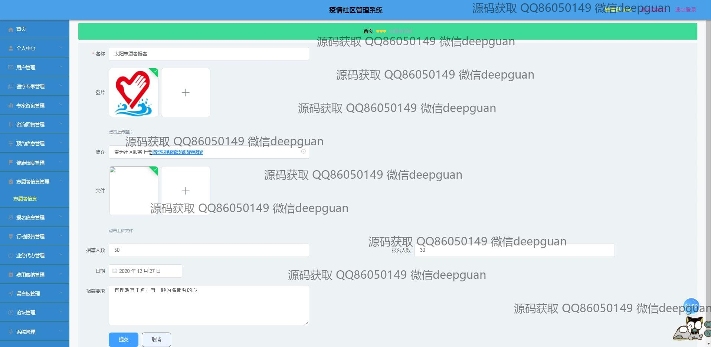
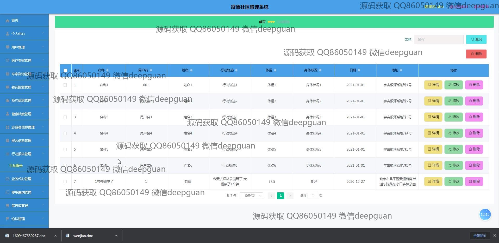

<h1 align="center">社区疫情综合管理系统vue</h1>

## 简介
社区疫情综合管理系统：角色分为管理员、用户、医疗专家；功能包括用户管理、专家管理、预约管理、疫情公告、健康档案、留言反馈、志愿者信息等模块。    --计算机毕业设计源码；毕设源码；java毕业设计源码

## 联系方式

<h3 align="center">获取完整代码与数据库文件 + 微信：deepguan QQ: 86050149 QQ群: 783742310</h3>

<h3 align="center">可帮忙远程部署 包运行成功！提供远程部署、修改代码、设计文档指导、代码讲解等服务！</h3>

## 功能介绍（完整见运行截图）
管理员：   
管理员可以访问包括用户管理、医生专家管理、预约信息管理、健康档案管理、咨询回复管理等功能模块。他们可以添加、修改、删除和查看系统用户与医疗专家的信息。同时，管理员负责查看、编辑和删除疫情公告，审核用户提交的信息，并管理在线论坛的帖子和留言反馈。管理员还能监控社区的健康状况，管理物资分发及费用缴纳。管理员通过个人中心可以修改自身信息，并有权限退出系统。   

医疗专家：   
医疗专家模块允许医生查看并修改自己的个人信息，如职称、联系方式和服务时间。他们可以接收预约信息并为社区居民提供咨询服务，医疗专家也可以参与到论坛交流中，分享医学知识和疫情防控建议。通过系统平台，医疗专家能够帮助社区居民了解健康状况，更好地预防管理疫情。   

用户：   
普通用户在系统中可以进行注册和登录，进入个人中心后可以查看和修改个人信息，进行预约，并获取和分享有关疫情的最新信息。在健康档案管理模块中，用户可以记录体温、健康状况及行动轨迹。用户可以参与论坛交流，与其他社区成员分享信息和反馈疫情相关问题。系统还设置了留言反馈功能，方便用户提交建议或提问。   

志愿者：   
志愿者信息管理模块使志愿者能够查看和更新自身信息，创建与管理志愿者活动，包括设置活动名称、日期和招募要求等。在参与活动的过程中，志愿者通过系统管理活动进展，发布和获取重要信息，以支持社区疫情管理。这些功能帮助志愿者协调与社区的合作，优化资源的使用和分配。

## 运行截图

本代码来源于网络,仅供学习参考使用!

